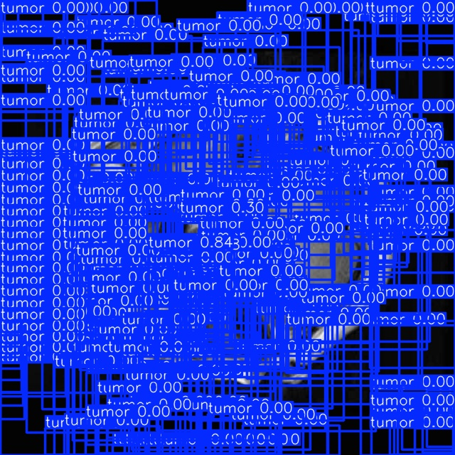
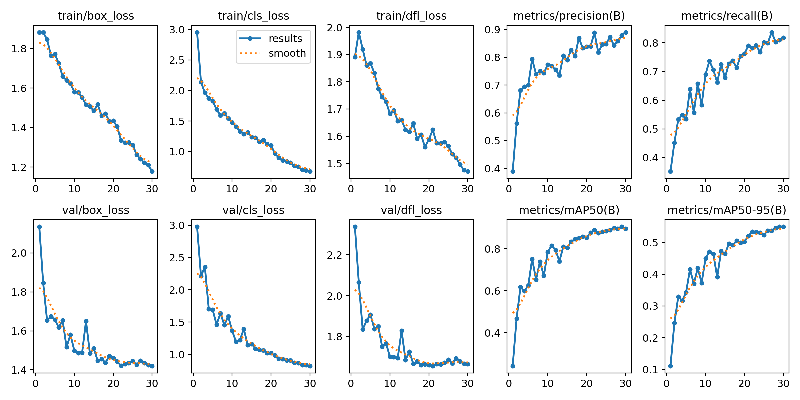
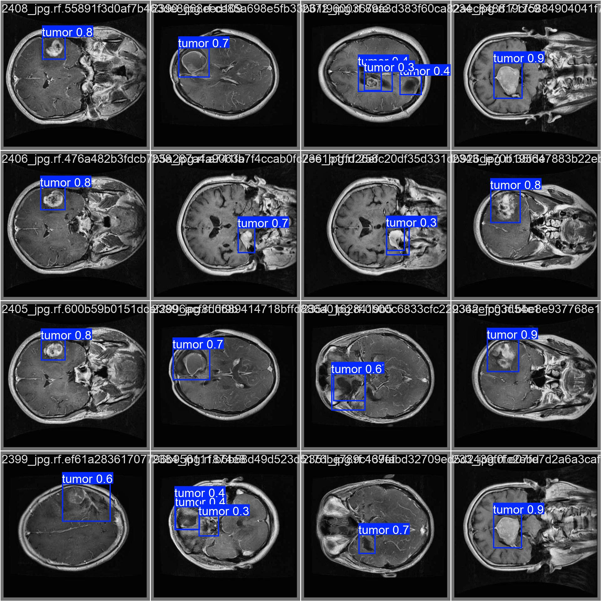
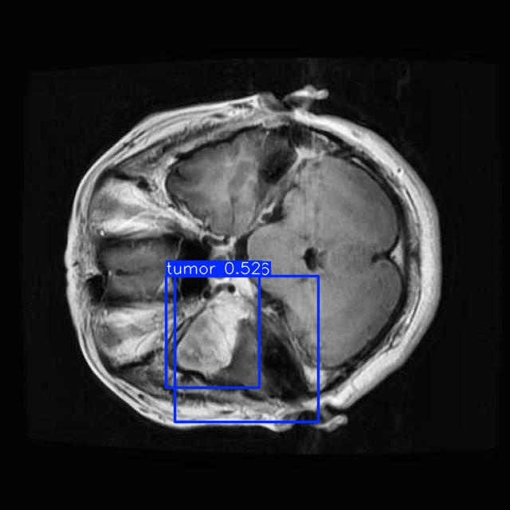

# Brain Tumor Detection — Bounding-Box Segmentation with YOLOv8  
**Author: Omar Madjitov**  
**Course: CSC 6850 — Machine Learning (Fall 2025)**  

---

## 📌 Overview

This repository documents the full pipeline for converting the course-provided COCO-style annotations into YOLO format, training YOLOv8-s on a single-class tumor detection task, and validating/inferencing with reproducible artifacts.

The dataset was originally framed as a semantic segmentation problem, but every “segmentation” mask was a perfect rectangle. UNet and other pixel-wise models saturated at IoU ≈ 0.66 because the labels never contained organic tumor outlines. The correct affordance for the dataset is therefore a **single-class bounding-box detection task**, which is what the current YOLOv8 pipeline implements.

The repo contains:
- Data converters (COCO → YOLO; YOLO → COCO)  
- Training, validation, and test inference scripts  
- Raw IoU / pixel-accuracy evaluations  
- Visualization assets for both training curves and predictions  
- Fully reproducible Jupyter notebook orchestrating every step

---

## ⚠️ Hardware & Device Selection

Training and inference were run on a **MacBook Pro (M4 Max)** using the **PyTorch MPS backend**. If you run the notebook on Windows or Linux, update the device selection to match the available hardware.

```python
# On macOS with Apple Silicon
device = "mps"

# On NVIDIA-backed Linux/Windows machines
device = "cuda"

# On CPU-only systems
device = "cpu"
```

Recommended toolchain for non-MPS environments:
- NVIDIA GPU with CUDA 12.x
- PyTorch built with CUDA support (match the CUDA version above)
- `ultralytics==8.3.x`
- Python 3.10 – 3.12

---

## 🗂️ Repository Layout

```
GROUP PROJECT/
│
├── dataset/
│   ├── train/                 # COCO annotations + YOLO labels for training
│   ├── valid/                 # COCO annotations + YOLO labels for validation
│   ├── test/                  # Test images + model-generated labels
│   │   └── test_annotations.coco.json  # Reconstructed COCO JSON for grading
│   └── dataset.yaml           # YOLO config pointing into the dataset folder
│
├── experiments/
│   ├── yolo_run8/             # Training logs, curves, and `weights/best.pt`
│   ├── yolo_run8_val_preds/   # Validation prediction overlays
│   └── yolo_run8_test_preds/  # Test set predictions from YOLOv8
│
├── src/
│   └── 06_YOLO_Clean_with_txt.ipynb  # Canonical notebook (sanity checks → inference)
│   └── *.ipynb                  # Supporting exploratory notebooks (UNet, segmentation, etc.)
│
├── requirements.txt
└── README.md
```

---

## 🛠️ Installation

```bash
git clone https://github.com/yourusername/brain-tumor-yolo.git
cd brain-tumor-yolo
pip install -r requirements.txt
```

If you are on Windows/Linux with an NVIDIA GPU, install a CUDA-enabled PyTorch wheel before running the notebook:

```bash
pip install torch torchvision --index-url https://download.pytorch.org/whl/cu121
```

---

## 📄 `dataset.yaml` (auto-generated)

```yaml
path: ../dataset
train: train/images
val: valid/images
test: test/images

names:
  0: tumor
```

---

## 🚀 Running the Notebook

Launch the notebook interface and execute `src/06_YOLO_Clean_with_txt.ipynb`. The notebook orchestrates every step from data quality checks through COCO/YOLO conversions, training, evaluations, and test-set predictions.

Pipeline steps (automated inside the notebook):
1. Dataset sanity checks
2. COCO → YOLO label conversion
3. Cleanup of stale `.cache` files
4. YOLOv8 training (detection task)
5. Validation predictions
6. Raw IoU and pixel accuracy computations
7. Test-set inference
8. Copying test predictions into `dataset/test/labels/`
9. YOLO → COCO JSON reconstruction for grading
10. Sample visualizations (train curves + predictions)

---

## 🧠 Model Training Summary

Final validation performance:

| Metric | Threshold | **Achieved** |
| :----- | :-------- | :----------- |
| Mean IoU | ≥ 0.70 | **0.7299** |
| Pixel Accuracy | ≥ 0.75 | **0.9097** |
| mAP@50 | — | **0.905** |

---

## 📊 Visualizations

During validation and test evaluation the notebook generates bounding-box overlays, precision/recall curves, and qualitative samples. The artifacts land in:
- `experiments/yolo_run8/` (training curves, confusion matrices, epoch logs)
- `experiments/yolo_run8_val_preds/` (validation overlay images)
- `experiments/yolo_run8_test_preds/` (test predictions saved as TXT + images)

### Selected Visual Evidence


*Segmentation-era YOLOv8 run predicting dozens of false positives—illustrates why the dataset required a detection framing.*


*Training and validation curves show convergence and the jump in mAP@50 once the detector starts learning meaningful tumor boxes.*


*Final YOLOv8 validation pass showing tight tumor localization with confident scores.*


*Improved single-box prediction for the same slice that produced 300 detections in the segmentation run.*

---

## 🧪 Running Inference on the Test Set

Execute the YOLO CLI to generate predictions on the blind test split:

```bash
!yolo predict \
    model=../experiments/yolo_run8/weights/best.pt \
    source=../dataset/test/images \
    save_txt=True \
    save_conf=True \
    conf=0.40 \
    project=../experiments \
    name=yolo_run8_test_preds
```

Copy the generated TXT labels into the test folder before reconstructing COCO JSON:

```python
import shutil, os

src = "../experiments/yolo_run8_test_preds/labels"
dst = "../dataset/test/labels"
for f in os.listdir(src):
    shutil.copy(os.path.join(src, f), os.path.join(dst, f))
print("Test labels copied.")
```

---

## 🧾 Generating COCO JSON for the Test Set

The notebook reconstructs a COCO-format JSON (`dataset/test/test_annotations.coco.json`) from the YOLO predictions so graders can evaluate the model in the original annotation schema. All boxes are converted from normalized YOLO coordinates to absolute pixel values, and the reconstruction adds the required `info`, `licenses`, `categories`, `images`, and `annotations` sections.

---

## ⚙️ Troubleshooting

1. **YOLO predicts hundreds of boxes.** Likely `conf=0.0`—raise the confidence threshold (recommend `conf=0.40`).
2. **Backend errors when running on Windows/Linux.** Remove `device = "mps"` and switch to `"cuda"` or `"cpu"` depending on hardware.
3. **YOLO errors referencing `.cache` files.** Delete cached files with `glob.glob("../dataset/**/*.cache", recursive=True)` before retraining.
4. **Missing labels after conversion.** Some COCO entries lacked an image—labels without matching images are dropped (`os.remove(label_file)` when `exists_image` is false).
5. **Raw IoU returns zero.** Ensure YOLO predictions are denormalized before comparing to COCO boxes; the notebook takes the top-1 prediction per image and converts to absolute pixels.
6. **Pixel accuracy is consistently > 0.90.** This is expected because >95% of each scan is background.

---

## 📦 Deliverables

- `experiments/yolo_run8/weights/best.pt` — Final YOLOv8-s weights.
- `experiments/raw_iou_results.csv` — Raw IoU metrics produced during validation.
- `dataset/test/test_annotations.coco.json` — Reconstructed COCO JSON for grading.
- `experiments/yolo_run8/results.png` — Training curves showing loss/precision/recall/mAP progression.
- `experiments/yolo_run8_val_preds/` and `experiments/yolo_run8_test_preds/` — Visual validation/test overlays and TXT prediction outputs.

---

## 🔁 Reproducing Training from Scratch

1. Launch `src/06_YOLO_Clean_with_txt.ipynb` and rerun the cells responsible for dataset checks, COCO → YOLO conversion, and cleanup of `.cache` files.
2. Train YOLOv8-s with `model.train(...)` using the dataset configuration shown above (30 epochs, `imgsz=640`, `batch=8`, `device=device`).
3. Once training completes, the notebook auto-generates validation/test predictions, copies test TXT labels into `dataset/test/labels/`, and rebuilds the COCO JSON file.

---

## 📚 Requirements

```text
ultralytics==8.3.233
torch==2.9.1
torchvision==0.20.1
numpy
opencv-python
matplotlib
tqdm
pyyaml
pandas
scikit-learn
albumentations
jupyter
```

---

## 📨 Contact

If you have questions about the pipeline or want to replicate the results, reach out via GitHub.  
**Omar Madjitov** 📧 omadjitov1@icloud.com  
🔗 https://www.linkedin.com/in/omar-madjitov-6b3a33234/

---

Thank you for reviewing my work!
